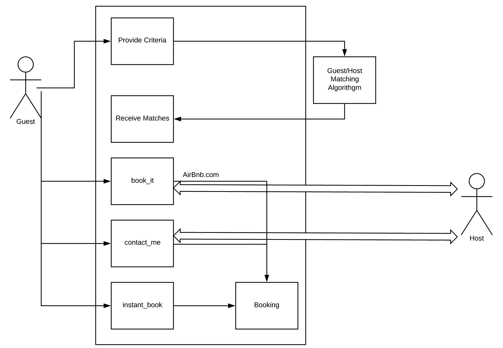
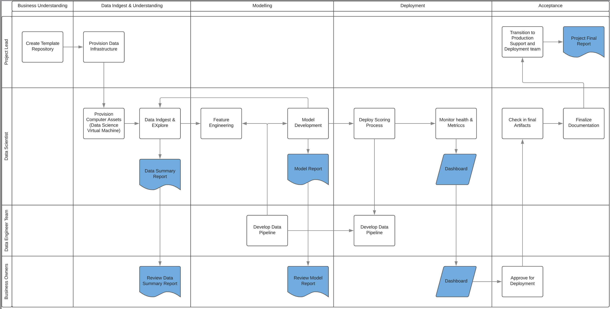

```{r setup, include=FALSE}
knitr::opts_chunk$set(echo = TRUE)
```

## Executive Summary

The purpose of this project is to identify, analyze and visualize the opportunities to incase successful guest-host matching for Airbnb in Rio de Janeiro.  We will focus on better understanding what causes guests on our platform to end up with a success booking or the reasons for an unsuccessful booking.

## Background

Airbnb is a two-sided marketplace which matches guest to hosts. The booking flow at Airbnb is as follows: a guest finds an available room(listing) that they like, and then they contact the host. 
Once the guest finds a listing they are interested in, there are three ways to end the host an inquiry: ‘contact_me’, ‘book_it’ or ‘instant_book’. Upon receiving the inquiry, the host can then decide whether or not to accept the request (for ‘contact_me’ and ‘book_it’ methods – ‘instant_book’ is auto-accepted).

## Project Scope

The project scope focuses on bookings made via contact_me, book_it or instant_book. The project will not focus on improving listing, improving guest’s profiles, providing pricing recommendation or any other attribute that does not focus on successful booking.

## Success Criteria

The three key metrics that would determine the success of the project are”

*	Percentage increase in ‘instant_book’ and ‘book_it’
*	Percentage drop in ‘contact_me’
*	Repeat customer bookings
*	Reduced cancellations of bookings
*	Increased overall guest bookings
*	Increased guest and host satisfaction rate
*	Increased visit to booking conversation ratio

## Stakeholders

This project is an essential initiative for Airbnb as it focuses on improving the organizations revenue. The stakeholders will differ in the analysis/recommendation stage and the implementation stage. This document only captures the initial stakeholders. The departments who will consume and benefit from this analysis are Product, Marketing, Web design, UX and business Operations. 

## Risks

Here are some of the Risks associated with not meeting the success metrics
*	Loss of revenue if the booking was not successful as we could not provide the correct match
*	Increased Guest and host frustration with inappropriate matches
*	Reputation loss as we might lose hosts and guest to competitors

## Model Usage/Implementation

We will be focusing on some key aspect to build the model and its usage

*	We will establish the relationship between key features/attributes that contribute towards a successful booking
*	We will determine and segment guests and hosts to understanding clusters and personas
*	We will build an optimization model to determine the best choice based on all the available options

## Business Functionality

The current booking process is based on a two-way engagement model where a guest is given a host recommendation based on their requirements. The guest can take one of three actions based on the match. The desired end product of this project will focus on identifying key features and attributes that contribute to instant_book. Also, we would like to identify what causes a successful vs unsuccessful contact_me and book_it contacts. 

## Assumption and Dependencies

The following assumptions and dependencies have been identified

*	We have access to the required data
*	The project resources will be allocated
*	The scope of the project will not be changed
*	The project is funded and identified as a key initiative

## Business Requirements for Future Investigation/Analysis

In future the project can include other factors that are not controlled and managed by AirBnb that may influence the bookings like the weather, time of the year, cost etc.

## Process Flow

Here is the current process flow diagram with the various components



## Action Plan and Task List



###Deliverables

* Data Summary Report (7 Days) : This report shows the findings from exploratory data analysis. 
* Model Report ( 7 Days) : The Model report explains the findings and recommendations of the model including the test/train data performance
* Dashboard (7 Days ) : This dashboard will help track and monitor key metrics
* Project Deployment ( 7 Days ) : After approval, final documentation and transition to deployment team


