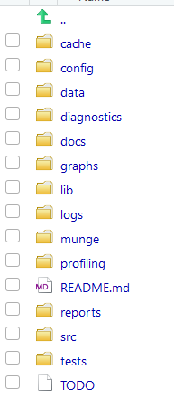

```{r setup, include=FALSE}
knitr::opts_chunk$set(echo = TRUE)
```

## Introduction

ProjectTemplate is a system for automating the thoughtless parts of a data analysis project:

* Organizing the files in your project.
* Loading all the R packages you'll use.
* Loading all of your data sets into memory.
* Munging and preprocessing your data into a form that's suitable for analysis.

More details can be obtained from the [CRAN](https://cran.r-project.org/web/packages/ProjectTemplate/index.html) package web site.


## Installation

ProjectTemplate is on CRAN and can be installed using a simple call to install.packages():

```{r eval=FALSE}
install.packages('ProjectTemplate')
```

## Creating a New Project

Once the package is installed you will have to call the next two lines everytime you need to create a new project:

```{r eval=FALSE}
library('ProjectTemplate')
create.project('<name_of_your_project>')
```

Running the above commands will result in creation of a folder structure similar to the one shown below helping you to organize your code, your data and your output:

  
 
## Loading a New Project

Besides creating an organizational structure, ProjectTemplate also offers some automation features.

Here is a closer look at how this automation works. First to load the project by running the following commands at the R command line:

```{r eval=FALSE}
setwd('path_to_your_project')
library('ProjectTemplate')
load.project()
```

During the load process ProjectTemplate looks through the data directory for files with recognized extensions, such as **.csv** or **.sql**, it will load the files into the memory generally in an R data frame format and assign a variable with the same name as the file name (without the extension).

Besides automatically loading data into the memory, the ProjectTemplate can also load required libraries for your project such as tidyr, dplyr, stringr, ggplot2, etc. To indicate which libraries you would like to load automatically, you have to edit the libraries `configuration` setting in the **config/global.dcf** file. For example:

`libraries: tidyr, dplyr, stringr, ggplot2`

If you want to stop auto loading libraries set the following setting to `FALSE`.

`load_libraries: FALSE`

In a similar way, you can control data loading as well. The data loading can be turned on or off by setting the `data_loading` to `TRUE` or `FALSE`.


